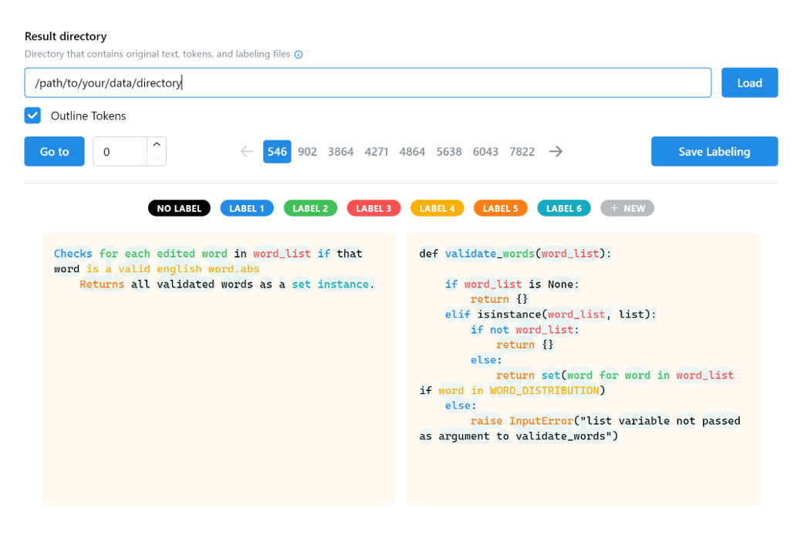

# Text Alignment Maker



## How to Run

> [!NOTE]
> This tool is still experimental.

### For Quicker Starting

First build the project for one time:

```
pnpm i
pnpx vite build
```

Then:

```
node server.js
```

### For Development

```
pnpm i
pnpm run dev
```

## Note

**Limited to string size in Web App, only `jsonl` files are accepted.**

The following files are required (each line is a sample):

+ A code tokens file `tokenized_code_tokens_train.jsonl`
+ A comment tokens file `tokenized_comment_tokens_train.jsonl`
+ A Training file `train.jsonl` that contains `['code']` and `['docstring']`
+ A labeling result file `sorted_labelling_sample_api.jsonl` , in format `result[numLabels][2][2 * numRanges]` , `2` is for comment and code respectively
